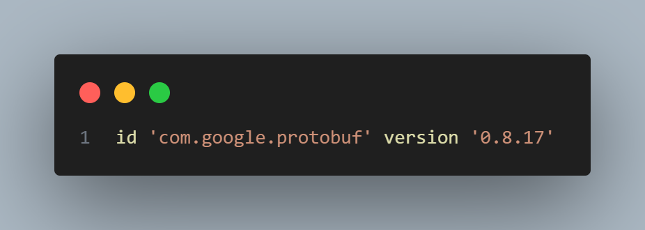
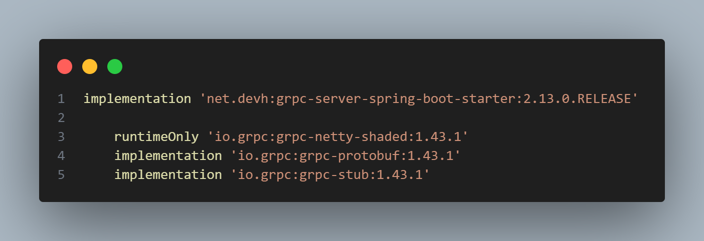
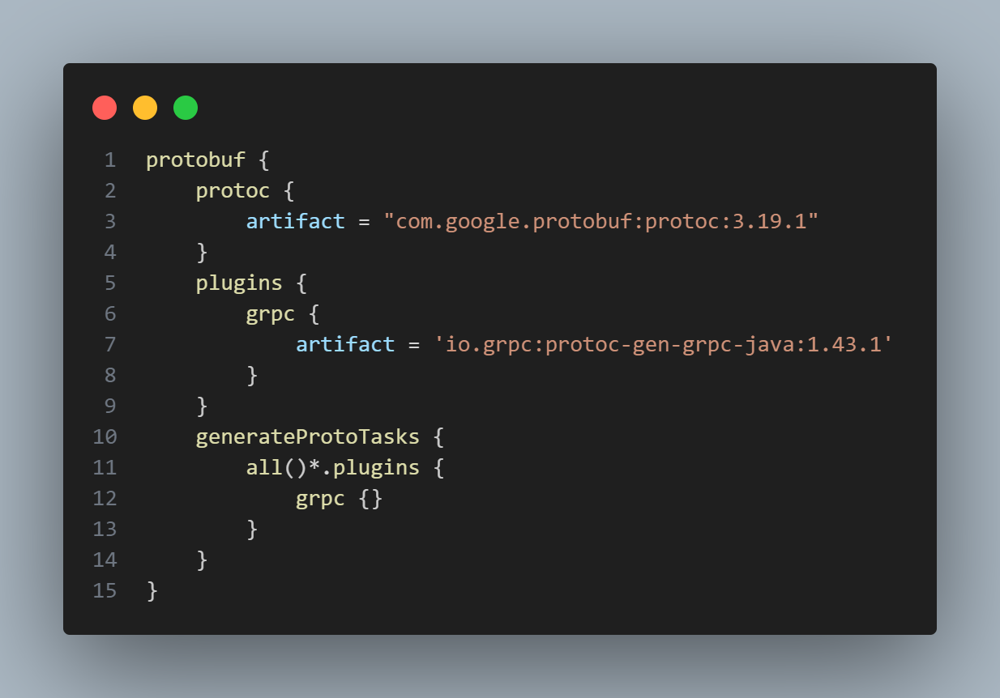
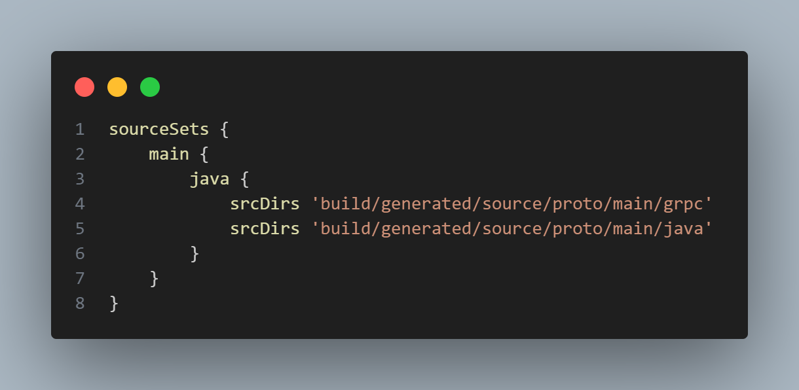

> **Grupo 15:** Trabajo grupal para la materia de sistemas distribuidos que implementa una arquitectura distribuida utilizando gRPC. El servidor gRPC está desarrollado en Java 17 con Spring, mientras que el cliente gRPC está implementado en C#. La base de datos utilizada es MySQL. Además, se integra un frontend desarrollado en React que se conecta al cliente  gRPC para proporcionar una interfaz de usuario.
> 
# Índice
#### Configuración - server
1. [Requisitos](#requisitos)
2. [Configuración de la Base de Datos](#configuración-de-la-base-de-datos)
   1. [Crea la Base de Datos](#crea-la-base-de-datos)
   2. [Configura el archivo `application.properties`](#configura-el-archivo-applicationproperties)
3. [Instalación de Gradle](#instalación-de-gradle)
   1. [Descargar e Instalar Gradle](#descargar-e-instalar-gradle)
   2. [Instalación Manual](#instalación-manual)
   3. [Configurar las Variables de Entorno](#configurar-las-variables-de-entorno)
   4. [Verificar la Instalación](#verificar-la-instalación)
   5. [Verifica la Configuración del Proyecto](#verifica-la-configuración-del-proyecto)
4. [Dependencias, Plugins y Configuración gRPC](#dependencias-plugins-y-configuración-grpc)
   1. [Agregar el Plugin de Protobuf](#agregar-el-plugin-de-protobuf)
   2. [Incluir las Dependencias Necesarias](#incluir-las-dependencias-necesarias)
   3. [Configurar Protocolo Buffer (Protobuf)](#configurar-protocolo-buffer-protobuf)
   4. [Especificar Directorios para Archivos Generados](#especificar-directorios-para-archivos-generados)
   5. [Compilar y Verificar](#compilar-y-verificar)
#### Configuración - cliente
5. [Instalación de .NET 6.0](#instalación-de-net-60)
6. [Configuración del Cliente gRPC](#configuración-del-cliente-grpc)
   1. [Instalar Dependencias](#instalar-dependencias)
   2. [Configurar Protocolo Buffer (Protobuf)](#configurar-protocolo-buffer-protobuf)
   3. [Restaurar, Compilar y Ejecutar](#restaurar-compilar-y-ejecutar)


## 1 - Requisitos

- [MySQL Workbench](https://www.mysql.com/products/workbench/)
- [Java 17](https://www.oracle.com/java/technologies/javase-downloads.html)
- [Gradle](https://gradle.org/install/)
- [.NET 6.0 SDK](https://dotnet.microsoft.com/en-us/download/dotnet/6.0)

## 2 - Configuración de la Base de Datos

2.1. **Crea la Base de Datos:**
   - Crea una nueva bd llamada `stockearte`'.

2.2. **Configura el archivo `application.properties`:**
   - Configura las credenciales y parámetros de conexión a tu base de datos en el archivo `application.properties` de tu proyecto.

## 3 - Instalación de Gradle

3.1. **Descargar e Instalar Gradle:**
   - Ve a [Gradle Releases](https://gradle.org/releases/).
   - Descarga la distribución más reciente (por ejemplo, `Gradle 8.9 Binary-Only`).

3.2. **Instalación Manual:**
   - Descomprime el archivo descargado en el directorio deseado. Por ejemplo, `C:/`.
   - Copia la dirección del directorio `bin` (por ejemplo, `C:\workspace\gradle-8.9-bin\gradle-8.9\bin`).

3.3. **Configurar las Variables de Entorno:**
   - Abre el Panel de Control y ve a `Sistema` > `Configuración avanzada del sistema` > `Variables de entorno`.
   - En `Variables del sistema`, encuentra la variable `Path`, selecciónala y haz clic en `Editar`.
   - Agrega la dirección del directorio `bin` que copiaste anteriormente a la lista de valores.
   - Guarda los cambios.

3.4. **Verificar la Instalación:**
   - Abrí una terminal y ejecuta el comando:
     ```bash
     gradle -version
     ```
   - Deberías ver la versión de Gradle instalada si todo está configurado correctamente.
     
3.5. **Verifica la Configuración del Proyecto:**
   - Abrí una nueva terminal en el directorio raíz del proyecto.
   - Ejecuta el siguiente comando para limpiar y construir el proyecto:
     ```bash
     gradle clean build
     ```
## 4 - Dependencias, Plugins y Configuración gRPC

Para integrar gRPC en tu proyecto, seguí estos pasos:

4.1. **Agregar el Plugin de Protobuf**

En tu archivo `build.gradle`, añade el plugin que se muestra en la siguiente imagen:



4.2. **Incluir las Dependencias Necesarias**

Añade las dependencias necesarias en la sección `dependencies` de tu archivo `build.gradle`, como se muestra en la imagen a continuación:



4.3. **Configurar Protocolo Buffer (Protobuf)**

Configura Protobuf en tu `build.gradle` para generar código Java a partir de archivos `.proto`. La configuración se muestra en la siguiente imagen:



4.4. **Especificar Directorios para Archivos Generados**

Define dónde se guardarán los archivos generados por Protobuf. Puedes ver esta configuración en la imagen:



4.5. **Compilar y Verificar**

Finalmente, ejecuta el siguiente comando para limpiar y compilar el proyecto, asegurándote de que todo funcione correctamente:

```bash
gradle clean build
```
-----------------------------------------------------------------------------------------------------------------------------------
## 5 - Instalación de .NET 6.0
5.1. **Descargar e Instalar .NET 6.0 SDK:**
   - Ir a [Descargas de .NET](https://dotnet.microsoft.com/en-us/download/dotnet/6.0).
   - Descargar la versión adecuada para tu sistema operativo.
   - Seguir las instrucciones de instalación.

5.2. **Verificar la Instalación:**
   - Abrir una terminal y ejecutar:
   
   ```bash
   dotnet --version
```
Esto debería mostrar la versión de .NET instalada.

## 6 - Configuración del Cliente gRPC

6.1. **Instalar Dependencias:**
   - Navegar al directorio raíz del proyecto cliente y ejecutar los siguientes comandos para agregar las dependencias de gRPC y Protobuf:
   
   ```bash
   dotnet add package Grpc.Net.Client
   dotnet add package Google.Protobuf
   dotnet add package Grpc.Tools
   ```
6.2. **Configurar Protocolo Buffer (Protobuf):**
   - En el archivo `.csproj` del proyecto cliente, agregar la configuración de Protobuf para que genere automáticamente el código necesario a partir de los archivos `.proto`:

   ```xml
   <ItemGroup>
     <Protobuf Include="Protos/your_service.proto" GrpcServices="Client" />
   </ItemGroup>
  ```
6.3. **Restaurar, Compilar y Ejecutar:**
   - Ejecutar los siguientes comandos para restaurar las dependencias, compilar y ejecutar el cliente:

   ```bash
   dotnet restore
   dotnet build
   dotnet run
  ```
 - Asegúrate de que el servidor esté corriendo para poder realizar las llamadas gRPC correctamente.
> **Nota:** También podes agregar swagger o usar alguna otra herramienta adicional si queres hacer pruebas.


## Recursos Adicionales

- [Documentación de Gradle](https://docs.gradle.org/current/userguide/userguide.html)
- [Documentación de Spring Boot](https://spring.io/projects/spring-boot)
- [Documentación de gRPC](https://grpc.io/docs/)
- [Documentación de Protobuf](https://developers.google.com/protocol-buffers/docs/overview)
- [Documentación de .NET gRPC](https://docs.microsoft.com/en-us/aspnet/core/grpc/?view=aspnetcore-6.0)
- [Documentación de .NET 6.0](https://docs.microsoft.com/en-us/dotnet/core/dotnet-five)
